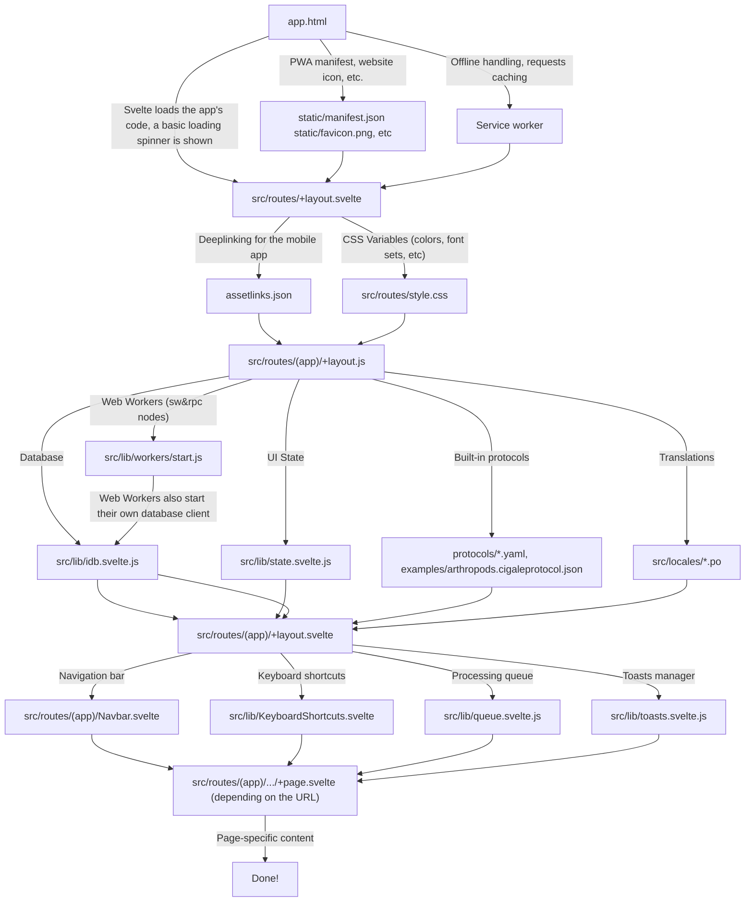
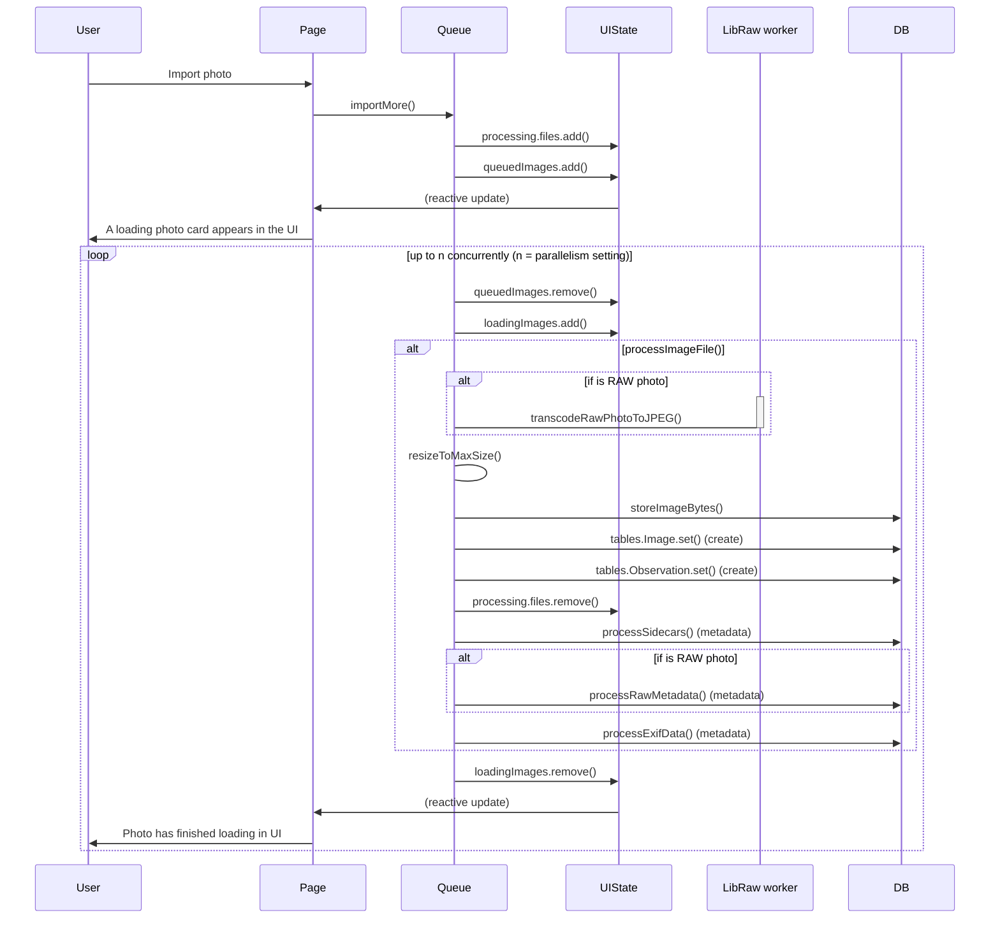
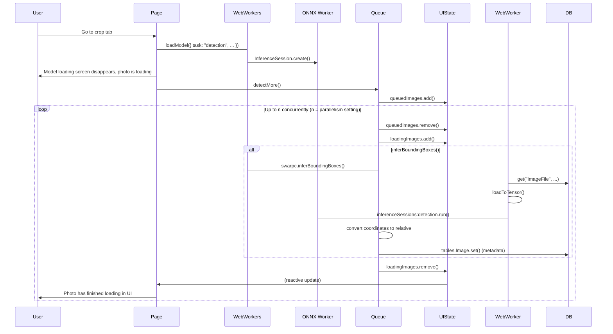
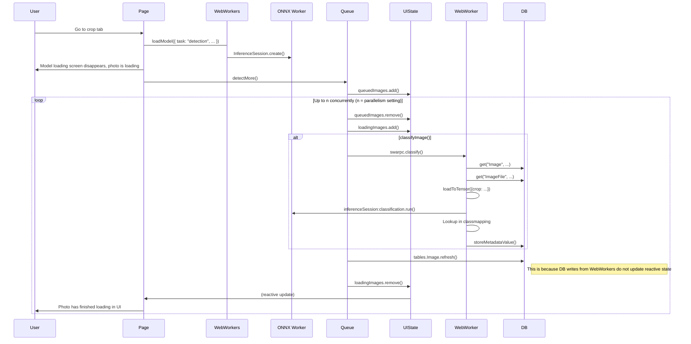

# cigale's codebase

Cigale is a local-only web-app, so one of the most important things is that there's no server-side.

## Tech stack

- A mix of [Typescript](https://typescript.com) and [plain JS with JSDoc](https://jsdoc.app/): new files should be written in Typescript. The project originally started with plain JS because it was a student group project and I didn't want everyone to have to learn yet another thing on top of Svelte. The conversion of the source code to Typescript is done gradually. Unfortunately, [automating the conversion doesn't seem feasible](https://github.com/cigaleapp/cigale/pull/984#pullrequestreview-3601220496).
- [Bun](https://bun.com): A Javascript (and Typescript) runtime and package (libraries) manager. We use it to manage dependencies, build the app and run the various scripts of the codebase. 
- [SvelteKit](https://kit.svelte.dev): A framework to build web applications using reusable bricks of interface called "components".
- [IndexedDB](https://developer.mozilla.org/en-US/docs/Glossary/IndexedDB): A database that's built into every browser, that allows us to store all of the data on the user's browser (remember, no server-side!)
- [sw&rpc](https://swarpc.js.org): Some tasks (such as running inference with neural network models) are resource-heavy. Running them normally would lag the interface, so we run it in the background using [Web Workers](https://developer.mozilla.org/en-US/docs/Web/API/Web_Workers_API/Using_web_workers). sw&rpc allows us to define functions that are to be run on these workers, while keeping type-safety and ease of use.
- [Wuchale](https://wuchale.dev): a library to translate the app into other languages (we offer French and English for now). It uses heuristics defined in its config file to determine which pieces of text are to be translated, and adds them to `.po` files so that they can be translated next.
- [Weblate](https://weblate.org/): A app to contribute translations of Cigale in other languages: it reads & writes the `.po` files created by Wuchale. Currently, Cigale's translations are done on at https://weblate.gwen.works, on my personal VPS.
- [Playwright](https://playwright.dev): Enables us to verify that the app works from the user's point of view: we write series of instructions (click on that button) and assertions (is the following text in the UI right now?) and Playwright launches a automated browser to simulate a user using the app.
- [Github Pages](): The service that hosts the web application, currently at https://cigaleapp.github.io/cigale. Since the app has no server-side, a [static]() web hosting service suffices.
- [Capacitor](https://capacitorjs.com): A technology to package a web app as a native mobile app that can be distributed on the app stores. It works by running a WebView with the app code, and also exposes functions to interact with the phone's OS as a native app could. Although the technology also supports iOS, we only build the app for Android for now.
- [Electron](https://www.electronjs.org/): Similarly to Capacitor, Electron is a technology to make a native desktop app that can be installed, and exposes ways to access things a website cannot access, such as the files of the computer it's installed on. It's also a bit more convenient to launch compared to having a volatile tab on a browser. The desktop app is currently not used by anybody though, so it's provided on a "best effort" basis. Currently, the only Electron-excluse feature is to have the app's progress bar reflected as a progress bar under the app icon. For now, the desktop app is only built for Windows, but could easily be built for other platforms too since Electron supports all three (MacOS, Windows and Linux).
- a [CORS](https://developer.mozilla.org/en-US/docs/Glossary/CORS) proxy: Some APIs (namely Kobocollect's) do not enable cross-origin requests, so we have to pretend that we aren't requesting from another website. This is done by running a small proxy server that takes in a URL, does the request, and returns the response back to the web app. Currently, this is done with a [CORS Anywhere]() server running on https://cors.gwen.works (my personal VPS) 

Some additional but less important developer tooling is also used: a formatter to keep the code pretty, a linter to prevent silly mistakes from finding their way on production.

## Deployment

The app is [continuously]() deployed from the main branch of the github repository. Once all automated checks (tests, linter, etc) pass, a CI workflow builds the application, and deploys it to Github Pages.

## Files & folders

- `.github/worfklows/`: all the CI workflows used to define automated checks (tests, linting, formatting, etc) and tasks (re-generating the Backbone protocol, etc)
- `.vscode/`: settings for the VSCode code editor that are useful to be shared with anyone working on Cigale (for example, recommended editor extensions to work on `.svelte` files, etc)
- `android/`: Source code for the Capacitor-backed mobile app.
- `examples/`: Contains the Backbone protocol (called "Example: arthropods" in the app, stored as `arthropods.cigaleprotocol.json` in that directory). It is generated from various data sources and provides the basis for all other protocols (mainly the huge list of species with their reference images and descriptions). Other protocols are also stored here but are only used for Playwright tests.
- `patches/`: Small modifications to libraries' source code, when the library does not work correctly and waiting for a new version is not feasible (the library has been abandonned, etc). Patches are applied using Bun's [`bun patch`](https://bun.com/docs/pm/cli/patch) system. 
- `protocols/`: Protocol definition files: INSECTA, Entomoscope, etc.
- `scripts/`: various scripts for miscellaneous tasks in the codebase: downloading fonts before building the application, generating schemas to validate protocol files (continue reading), etc.
- `scripts/` [for now](https://github.com/cigaleapp/cigale/pull/1313): the directory also has script to generate the Backbone protocol (continue reading)
- `src/**/*.test.{ts,js}`: files that contain only unit tests, that test functions located in the related file (that has the same filename, without the  `.test`)
- `src/electron/`: Contains source code specific to Electron, mostly functions that are meant to run on the desktop, outside of the web app, via Electron.
- `src/lib/schemas/`: declare the shape of the app's data (for example, a Observation has a label; a list of Images, etc)
- `src/lib/metadata/`: various functions to manipulate metadata (split into multiple files because a single file would be too large)
- `src/lib/*.{js,ts}`: mostly individual functions that do one specific thing. Some files end in `.svelte.{js,ts}` because they contain [Svelte runes](https://svelte.dev/docs/svelte/svelte-js-files), mostly for shared reactive state purposes.
- `src/lib/*.svelte`: UI components that are not specific to a single part of the application (for example, ButtonIcon)
- `src/lib/state.svelte.js`: A singleton class `UIState` that stores global data associated with the app, but that doesn't need to be stored persistently in the database. For example, the currently-open session. The class also has a bunch of convenience properties (for example, `UIState.currentSessionId` is a actual field that is changed, but `UIState.currentSession` is a `get`-property that allows us to have access to the currently-open session object without having to fetch it from the database manually every time).
- `src/lib/database.svelte.js`: Declares all the tables that are stored in the database. It mostly uses types defined in `src/lib/schemas/`.
- `src/lib/idb.svelte.js`: Declares migration steps when database changes require those, and a system to have a in-memory, reactive view of the database so that the UI can respond to changes without having to query the database again. Most tables are in that in-memory view, but some aren't because it isn't feasible, RAM-wise (for example, the `MetadataOption` table that stores all enum variants of all protocols can have upwards of 20k objects, as the Backbone protocol contains a lot of species)
- `src/locales/`: [Gettext `.po`]() files for translations. The app's source code is written in French, but we offer a English translation. Wuchale and Weblate deal with those files, they can be manually edited but aren't meant to be.
- `src/routes/**/+page.svelte`: The different pages (when the URL changes it means we're on a different page) of the app. 
- `src/routes/**/+layout.svelte`: Interface parts that are shared by multiple pages: for example, the navigation bar at the top.
- `src/routes/**/*.{svelte,js,ts}`: Components and functions that are only used in specific routes
- `src/routes/worker/procedures.js`: Defines the types of inputs & outputs for functions that are run on web workers, via swarpc
- `src/routes/worker/start.js`: Imported during app startup to 
- `src/routes/worker/*.{ts,js}`: Implements the functions declared in `procedures.js`
- `src/app.d.ts`: Additional type declarations, for example to declare additional properties & methods on the `Window` global object.
- `src/app.html`: The HTML shell for the web application: this is what the user's browser intially receives. It contains placeholders that, at build time, are replaced with `<script>` tags that load the app's code.
- `src/hooks.server.js`: Code that runs before every page, at build-time. Mostly used by Wuchale to replace hard-coded text with calls to its functions that allow the shown text to change depending on the selected language.
- `src/service-worker.js`: A [service worker](https://developer.mozilla.org/en-US/docs/Web/API/ServiceWorker), that intercepts all requests the app makes and allows for aggressive caching of, for example, the app's source code. This is also where all web requests are handled if the app is launched while offline.
- `static/`: various files that are meant to be available as-is on `https://cigaleapp.github.io/cigale`. Mostly logos, fonts and JSON Schemas for protocol definition files, JSON analysis files in ZIP result exports, etc.
- `tests/*.spec.{ts,js}`: Playwright tests
- `tests/*.spec.{ts,js}-snpahots/`: Snapshots for tests (see Playwright docs), for example exported images to verify that nothing broke the results export code.
- `tests/tasks/*.spec.{ts,js}`: Playwright "tests" that aren't really tests, but Playwright is useful to achieve the task at hand. For example, generating up-to-date screenshots of the app.
- `tests/setup/database.ts`: Code that runs before every tests: for example, it fills the database with dummy data, and stores it so that all other tests can re-use that stored state without having to fill the database by themselves (which can be long if filling the database involves importing photos, running NN inference, etc)
- `tests/fixtures/`: Various files that are used in tests (photos, etc)
- `fixtures.ts`: Sets up various things that are the same for all tests. See Playwright documentation for more.
- `utils/`: Various utility functions for writing tests (for example, `importPhotos` runs instructions that import photos into the app)
- `/`: Most files directly at the root of the repository are configuration files for the various developer tooling.

## Flows

### Launching the app

### Creating a session

### Processing photos

#### Import

#### Crop

#### Classify

### Exporting results
