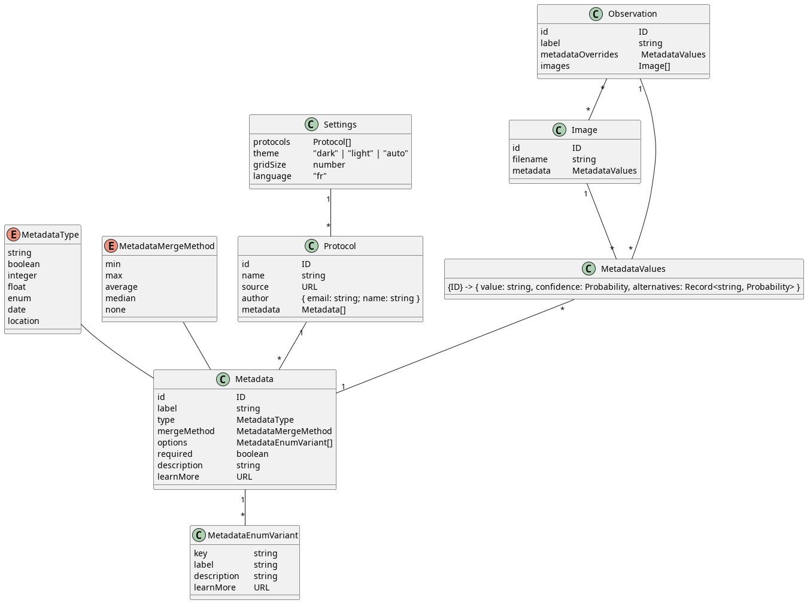

# CIGALE

Classification Intelligente et Gestion des Arthropodes et de L'Entomofaune

## Déploiement

```
npm i
npm run build
# le site est dans public/
```

## Développement

1. Cloner le repo

   ```
   git clone https://github.com/cigaleapp/cigale --single-branch main
   ```

   Le `--single-branch` est utile pour ne pas cloner la branche `gh-pages`, qui est assez lourde

1. Installer Volta

   Linux / MacOS / Windows (WSL)

   ```
   curl https://get.volta.sh | bash
   ```

   Windows

   ```
   winget install Volta.Volta
   ```

1. Installer les dépendances
   Dans le dossier du Projet

   ```
   npm i
   ```

1. Lancer le serveur de développement

   ```
   npm run dev
   ```

1. Pour respecter la convention de nommage des commits:
   ```
   # au lieu de git commit
   npm run commit
   ```

### Organisation de données


