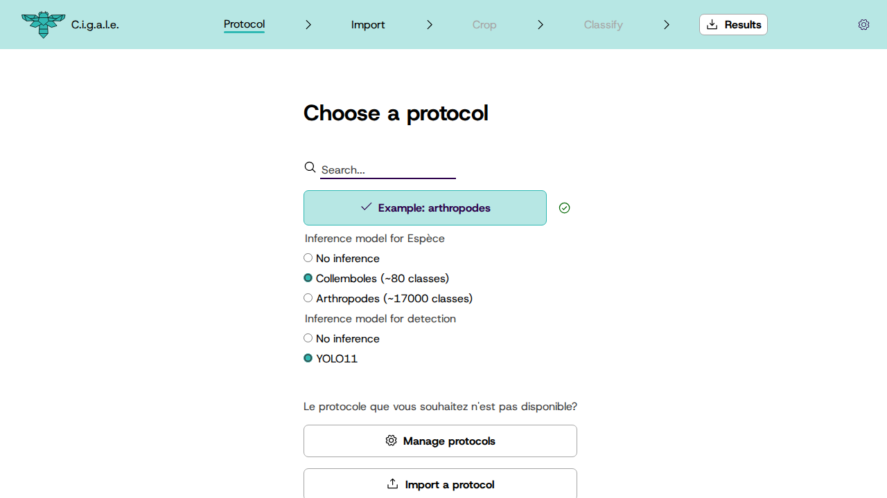
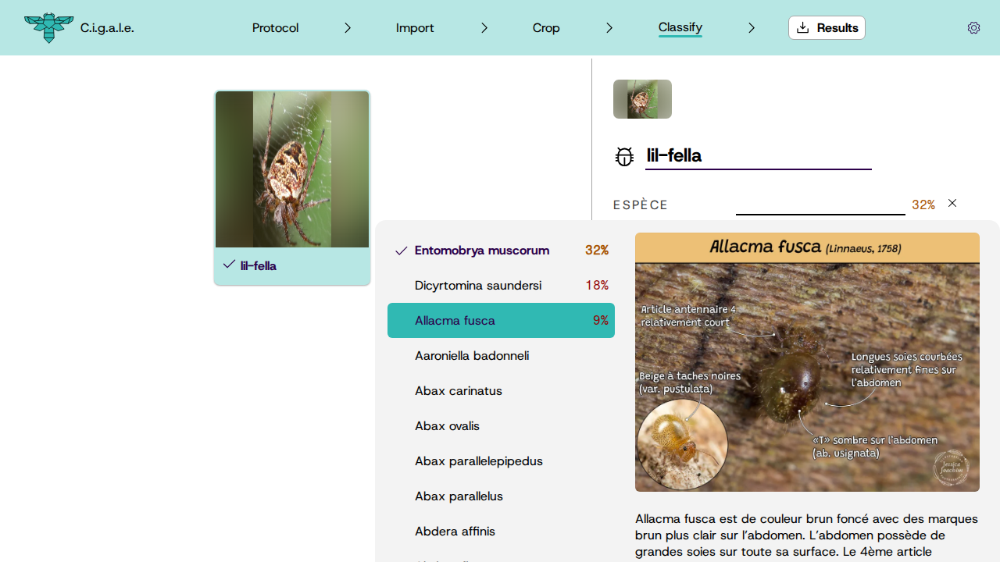

   <h1>
      
      CIGALE
   </h1>
   <em>
			Classification Intelligente et Gestion des Arthropodes et de L'Entomofaune
   </em>

English · <a href="./README_FR.md">Français</a>

---

A web application to assist in classifying photos of arthropods, with cropping and semi-automatic classification via neural networks.

Works offline (just visit the site once for it to be available without an Internet connection).

## How it works

### 1. Choose a protocol

CIGALE has an advanced protocol definition system to best fit your needs and scientific protocol. A example protocol, to classify arthropods with taxonomic information and species classification, is provided by default with the application.

### 2. Import your photos

Import your photos, and let the detection neural network find one (or more) arthropods per photo. Define bounding boxes around them.

### 3. Confirm the bounding boxes

The next tab allows you to go through each photo to adjust the bounding boxes detected by the neural network. You can adjust them, delete them, or add new ones.

### 4. Classify and annotate the arthropods

The "Classification" tab launches an inference from the classification neural network, which identifies the species for each detected bounding box. You can then confirm or modify the classification using helpful images and descriptions. For the default protocol, they come from [les Carnets de Jessica](https://jessica-joachim.fr), [GBIF](https://gbif.org), and other sources.

Parent taxonomic affiliations (genus, family, order, class, phylum, etc.) are automatically deduced from the chosen species.

### 5. Export your results

Finally, it is possible to export the data as a .zip file, containing the cropped photos, the associated metadata (annotations), and (optionally) the original photos.

Metadata is exported in CSV format for easy use in a spreadsheet, and in JSON format for programmatic use (in a Python script, for example).

## Contributors

<!-- ALL-CONTRIBUTORS-LIST:START - Do not remove or modify this section -->
<!-- prettier-ignore-start -->
<!-- markdownlint-disable -->
<table>
  <tbody>
    <tr>
      <td align="center" valign="top" width="14.28%"><a href="https://gwen.works/"> <b>Gwenn Le Bihan</b></a> <a href="https://github.com/cigaleapp/cigale/commits?author=gwennlbh" title="Code">💻</a> <a href="https://github.com/cigaleapp/cigale/actions" title="Infrastructure (Hosting, Build-Tools, etc)">🚇</a> <a href="https://github.com/cigaleapp/cigale/issues/77" title="Maintenance">🚧</a> <a href="https://github.com/cigaleapp/cigale/milestones" title="Project Management">📆</a> <a href="https://github.com/cigaleapp/cigale/tree/main/tests" title="Tests">⚠️</a> <a href="https://www.figma.com/design/2TY5zZvwfuxyotEtRMlWq7/CIGALE-Designs?node-id=0-1&t=tbAUPD1mQBUX926G-1" title="Design">🎨</a> <a href="https://www.canva.com/design/DAGgr_TmduM/6ULoR8Qmb2In9_DkBiiP3A/edit" title="Talks">📢</a> <a href="https://weblate.gwen.works/projects/cigale/" title="Translation">🌍</a></td>
      <td align="center" valign="top" width="14.28%"><a href="https://jessica-joachim.com/qui-suis-je/"> <b>Jessica Joachim</b></a> <a href="https://cigaleapp.github.io/cigale/about" title="Content">🖋</a></td>
      <td align="center" valign="top" width="14.28%"><a href="https://github.com/edgaremy"> <b>Edgar Remy</b></a> <a href="https://github.com/cigaleapp/cigale/issues?q=author%3Aedgaremy" title="Bug reports">🐛</a> <a href="#userTesting-edgaremy" title="User Testing">📓</a> <a href="https://cigaleapp.github.io/cigale/about" title="Data">🔣</a> <a href="#ideas-edgaremy" title="Ideas, Planning, & Feedback">🤔</a> <a href="https://github.com/cigaleapp/cigale/milestones" title="Project Management">📆</a> <a href="https://weblate.gwen.works/projects/cigale/" title="Translation">🌍</a></td>
      <td align="center" valign="top" width="14.28%"><a href="https://github.com/mcauchoix"> <b>mcauchoix</b></a> <a href="https://github.com/cigaleapp/cigale/issues?q=author%3Amcauchoix" title="Bug reports">🐛</a> <a href="#userTesting-mcauchoix" title="User Testing">📓</a> <a href="#promotion-mcauchoix" title="Promotion">📣</a> <a href="#fundingFinding-mcauchoix" title="Funding Finding">🔍</a> <a href="#ideas-mcauchoix" title="Ideas, Planning, & Feedback">🤔</a> <a href="https://cigaleapp.github.io/cigale/about" title="Content">🖋</a> <a href="https://github.com/cigaleapp/cigale/milestones" title="Project Management">📆</a></td>
      <td align="center" valign="top" width="14.28%"><a href="https://github.com/WhiSp00n"> <b>whisp00n</b></a> <a href="https://github.com/cigaleapp/cigale/commits?author=WhiSp00n" title="Code">💻</a> <a href="https://www.figma.com/design/2TY5zZvwfuxyotEtRMlWq7/CIGALE-Designs?node-id=0-1&t=tbAUPD1mQBUX926G-1" title="Design">🎨</a> <a href="https://www.canva.com/design/DAGgr_TmduM/6ULoR8Qmb2In9_DkBiiP3A/edit" title="Talks">📢</a> <a href="https://weblate.gwen.works/projects/cigale/" title="Translation">🌍</a></td>
      <td align="center" valign="top" width="14.28%"><a href="https://github.com/CceceLaPlante"> <b>CeceLaPlante</b></a> <a href="https://github.com/cigaleapp/cigale/commits?author=CceceLaPlante" title="Code">💻</a> <a href="https://www.canva.com/design/DAGgr_TmduM/6ULoR8Qmb2In9_DkBiiP3A/edit" title="Talks">📢</a></td>
      <td align="center" valign="top" width="14.28%"><a href="https://github.com/InesCharles"> <b>inescharles</b></a> <a href="https://github.com/cigaleapp/cigale/commits?author=InesCharles" title="Code">💻</a> <a href="https://www.canva.com/design/DAGgr_TmduM/6ULoR8Qmb2In9_DkBiiP3A/edit" title="Talks">📢</a> <a href="https://www.figma.com/design/2TY5zZvwfuxyotEtRMlWq7/CIGALE-Designs?node-id=0-1&t=tbAUPD1mQBUX926G-1" title="Design">🎨</a></td>
    </tr>
    <tr>
      <td align="center" valign="top" width="14.28%"><a href="https://github.com/axelcarlier"> <b>axelcarlier</b></a> <a href="https://github.com/cigaleapp/cigale/milestones" title="Project Management">📆</a></td>
    </tr>
  </tbody>
</table>

<!-- markdownlint-restore -->
<!-- prettier-ignore-end -->

<!-- ALL-CONTRIBUTORS-LIST:END -->

  <a href="https://www.gbif.org/species/165599324">🐞</a>
  <a href="https://www.gbif.org/species/4342">🐜</a>
  <a href="https://www.gbif.org/species/797">🦋</a>
  <a href="https://www.gbif.org/species/1718308">🦗</a>
  <a href="https://www.gbif.org/species/1341976">🐝</a>
  <a href="https://www.gbif.org/species/1496">🕷️</a>
  <a href="https://www.gbif.org/species/797">🐛</a>
  <a href="https://www.gbif.org/species/1524843">🪰</a>
  <a href="https://www.gbif.org/species/1043502">🪲</a>

