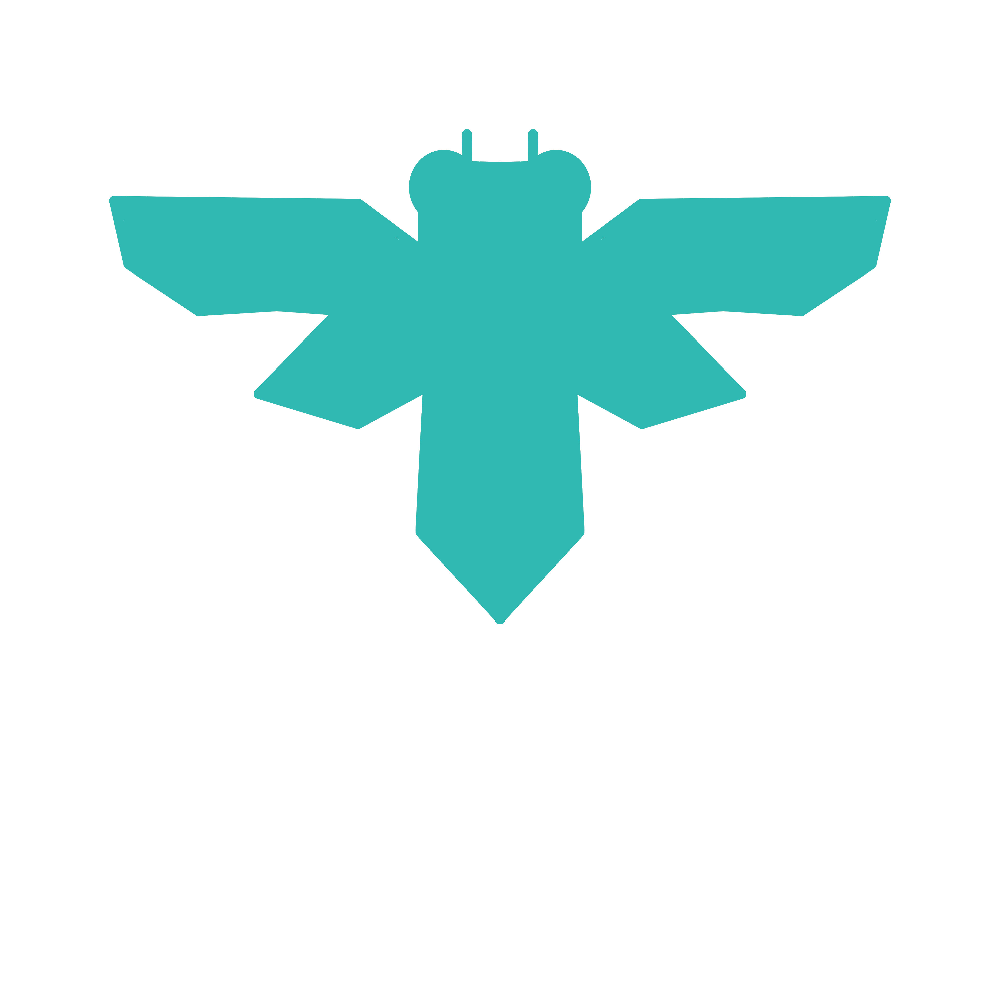
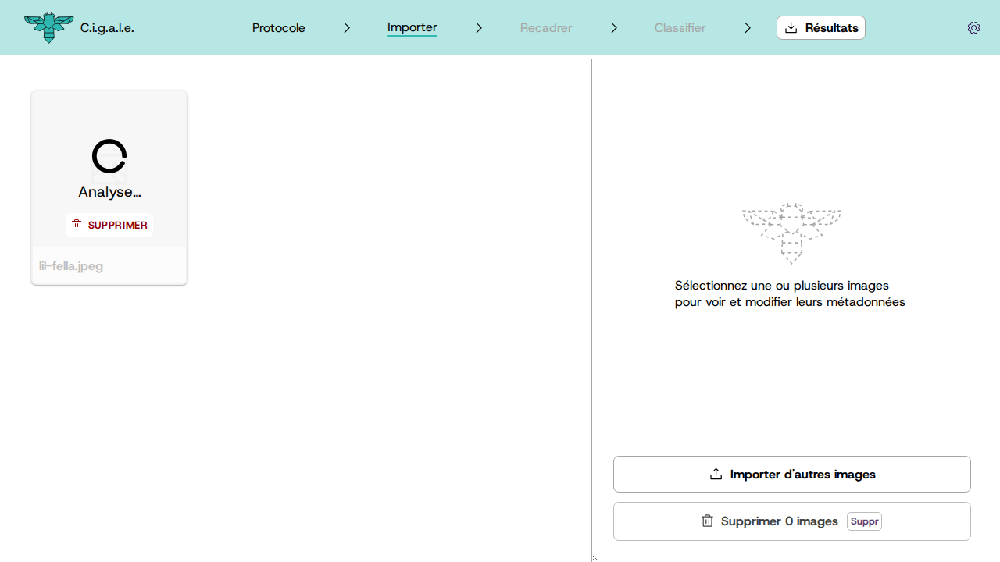
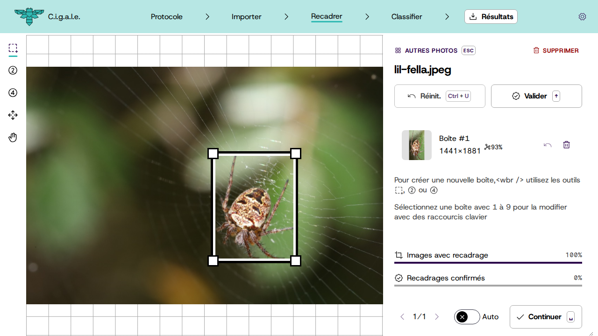
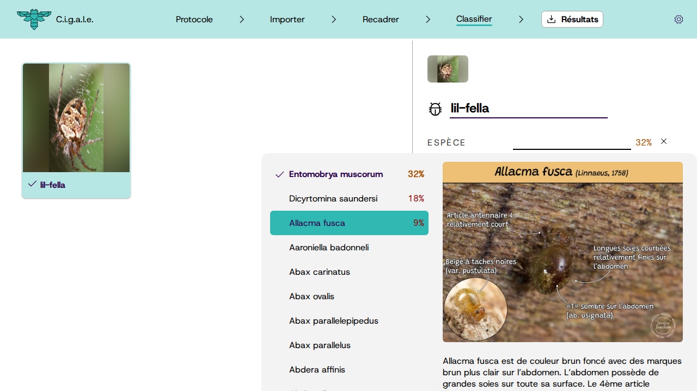
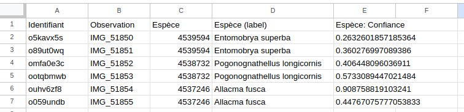

   <h1>
      
      CIGALE
   </h1>
   <em>
			Classification Intelligente et Gestion des Arthropodes et de L'Entomofaune
   </em>

<a href="./README.md">English</a> · Français

---

Une application web pour aider à la classification de photos d'arthropodes, avec recadrage et classification semi-automatique par réseaux de neurones.

Fonctionne hors-connexion (il suffit d'aller sur le site une seule fois pour qu'il soit disponible hors ligne).

## Fonctionnement

### 1. Choisissez un protocole

CIGALE dispose d'un système avancé de définition de protocoles pour coller au mieux à vos besoins et à votre protocole scientifique. Un protocole de classification d'arthropodes avec informations taxonomiques et classification par espèce est fourni de base avec l'application.

### 2. Importez vos photos

Importez vos photos, et laissez faire le réseau neuronal de détection qui va trouver un (ou plusieurs) arthropodes par photo, et définir des boîtes englobantes autour d'eux.

### 3. Confirmez les recadrages

L'onglet suivant permet de passer sur chaque photo afin d'ajuster les boîtes englobantes détectées par le réseau neuronal. Vous pouvez les ajuster, les supprimer ou en ajouter de nouvelles.

### 4. Classifiez et annotez les arthropodes

L'onglet "Classification" lance une inférence du réseau neuronal de classification, qui permet d'identifier l'espèce pour chaque boîte englobante trouvée. Vous pouvez alors confirmer ou modifier la classification, à l'aide d'image et de descriptions utiles. Pour le protocole par défaut, elles sont tirées de [les Carnets de Jessica](https://jessica-joachim.fr), [GBIF](https://gbif.org) et d'autres sources.

Les appartenances aux clades taxonomiques supérieures (genre, famille, ordre, classe, phylum, etc) sont déduites automatiquement à partir de l'espèce choisie.

### 5. Exportez vos données

Enfin, il est possible d'exporter les données en .zip, avec les photos recadrées, les métadonnées (annotations) associées et (optionnellement) les photos originales.

Les métadonnées sont exportées au format CSV pour utilisation facile dans un tableur, et au format JSON pour une utilisation programmatique dans un script Python par exemple.

## Contributeur·ice·s

<!-- ALL-CONTRIBUTORS-LIST:START - Do not remove or modify this section -->
<!-- prettier-ignore-start -->
<!-- markdownlint-disable -->
<table>
  <tbody>
    <tr>
      <td align="center" valign="top" width="14.28%"><a href="https://gwen.works/"> <b>Gwenn Le Bihan</b></a> <a href="https://github.com/cigaleapp/cigale/commits?author=gwennlbh" title="Code">💻</a> <a href="https://github.com/cigaleapp/cigale/actions" title="Infrastructure (Hosting, Build-Tools, etc)">🚇</a> <a href="https://github.com/cigaleapp/cigale/issues/77" title="Maintenance">🚧</a> <a href="https://github.com/cigaleapp/cigale/milestones" title="Project Management">📆</a> <a href="https://github.com/cigaleapp/cigale/tree/main/tests" title="Tests">⚠️</a> <a href="https://www.figma.com/design/2TY5zZvwfuxyotEtRMlWq7/CIGALE-Designs?node-id=0-1&t=tbAUPD1mQBUX926G-1" title="Design">🎨</a> <a href="https://www.canva.com/design/DAGgr_TmduM/6ULoR8Qmb2In9_DkBiiP3A/edit" title="Talks">📢</a> <a href="https://weblate.gwen.works/projects/cigale/" title="Translation">🌍</a></td>
      <td align="center" valign="top" width="14.28%"><a href="https://jessica-joachim.com/qui-suis-je/"> <b>Jessica Joachim</b></a> <a href="https://cigaleapp.github.io/cigale/about" title="Content">🖋</a></td>
      <td align="center" valign="top" width="14.28%"><a href="https://github.com/edgaremy"> <b>Edgar Remy</b></a> <a href="https://github.com/cigaleapp/cigale/issues?q=author%3Aedgaremy" title="Bug reports">🐛</a> <a href="#userTesting-edgaremy" title="User Testing">📓</a> <a href="https://cigaleapp.github.io/cigale/about" title="Data">🔣</a> <a href="#ideas-edgaremy" title="Ideas, Planning, & Feedback">🤔</a> <a href="https://github.com/cigaleapp/cigale/milestones" title="Project Management">📆</a> <a href="https://weblate.gwen.works/projects/cigale/" title="Translation">🌍</a></td>
      <td align="center" valign="top" width="14.28%"><a href="https://github.com/mcauchoix"> <b>mcauchoix</b></a> <a href="https://github.com/cigaleapp/cigale/issues?q=author%3Amcauchoix" title="Bug reports">🐛</a> <a href="#userTesting-mcauchoix" title="User Testing">📓</a> <a href="#promotion-mcauchoix" title="Promotion">📣</a> <a href="#fundingFinding-mcauchoix" title="Funding Finding">🔍</a> <a href="#ideas-mcauchoix" title="Ideas, Planning, & Feedback">🤔</a> <a href="https://cigaleapp.github.io/cigale/about" title="Content">🖋</a> <a href="https://github.com/cigaleapp/cigale/milestones" title="Project Management">📆</a></td>
      <td align="center" valign="top" width="14.28%"><a href="https://github.com/WhiSp00n"> <b>whisp00n</b></a> <a href="https://github.com/cigaleapp/cigale/commits?author=WhiSp00n" title="Code">💻</a> <a href="https://www.figma.com/design/2TY5zZvwfuxyotEtRMlWq7/CIGALE-Designs?node-id=0-1&t=tbAUPD1mQBUX926G-1" title="Design">🎨</a> <a href="https://www.canva.com/design/DAGgr_TmduM/6ULoR8Qmb2In9_DkBiiP3A/edit" title="Talks">📢</a> <a href="https://weblate.gwen.works/projects/cigale/" title="Translation">🌍</a></td>
      <td align="center" valign="top" width="14.28%"><a href="https://github.com/CceceLaPlante"> <b>CeceLaPlante</b></a> <a href="https://github.com/cigaleapp/cigale/commits?author=CceceLaPlante" title="Code">💻</a> <a href="https://www.canva.com/design/DAGgr_TmduM/6ULoR8Qmb2In9_DkBiiP3A/edit" title="Talks">📢</a></td>
      <td align="center" valign="top" width="14.28%"><a href="https://github.com/InesCharles"> <b>inescharles</b></a> <a href="https://github.com/cigaleapp/cigale/commits?author=InesCharles" title="Code">💻</a> <a href="https://www.canva.com/design/DAGgr_TmduM/6ULoR8Qmb2In9_DkBiiP3A/edit" title="Talks">📢</a> <a href="https://www.figma.com/design/2TY5zZvwfuxyotEtRMlWq7/CIGALE-Designs?node-id=0-1&t=tbAUPD1mQBUX926G-1" title="Design">🎨</a></td>
    </tr>
    <tr>
      <td align="center" valign="top" width="14.28%"><a href="https://github.com/axelcarlier"> <b>axelcarlier</b></a> <a href="https://github.com/cigaleapp/cigale/milestones" title="Project Management">📆</a></td>
    </tr>
  </tbody>
</table>

<!-- markdownlint-restore -->
<!-- prettier-ignore-end -->

<!-- ALL-CONTRIBUTORS-LIST:END -->

  <a href="https://www.gbif.org/species/165599324">🐞</a>
  <a href="https://www.gbif.org/species/4342">🐜</a>
  <a href="https://www.gbif.org/species/797">🦋</a>
  <a href="https://www.gbif.org/species/1718308">🦗</a>
  <a href="https://www.gbif.org/species/1341976">🐝</a>
  <a href="https://www.gbif.org/species/1496">🕷️</a>
  <a href="https://www.gbif.org/species/797">🐛</a>
  <a href="https://www.gbif.org/species/1524843">🪰</a>
  <a href="https://www.gbif.org/species/1043502">🪲</a>

